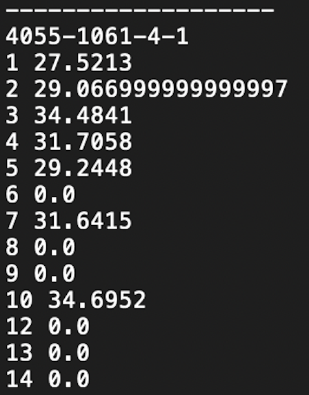
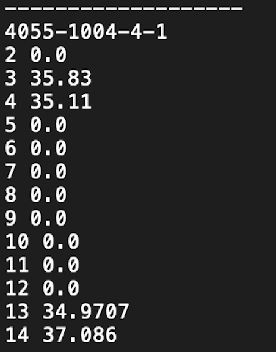
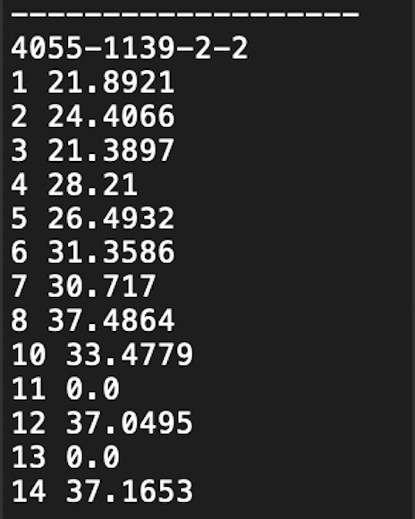
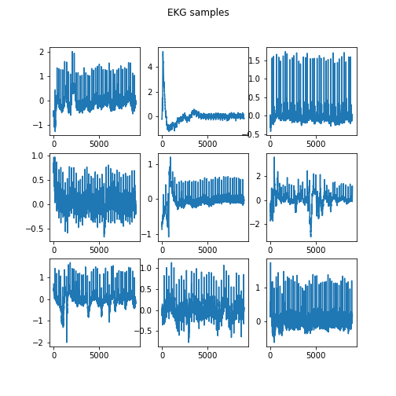
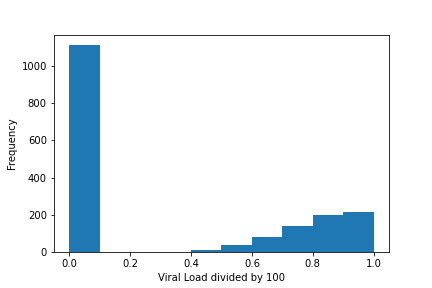
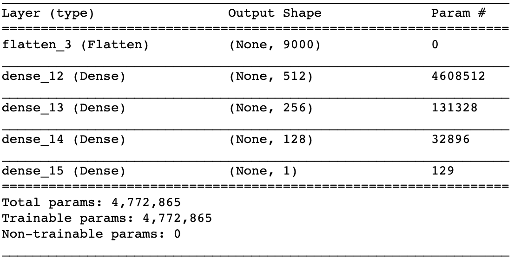
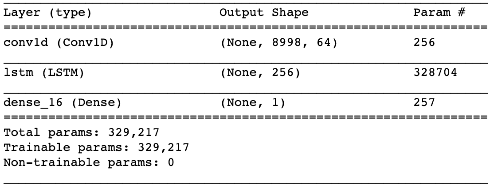
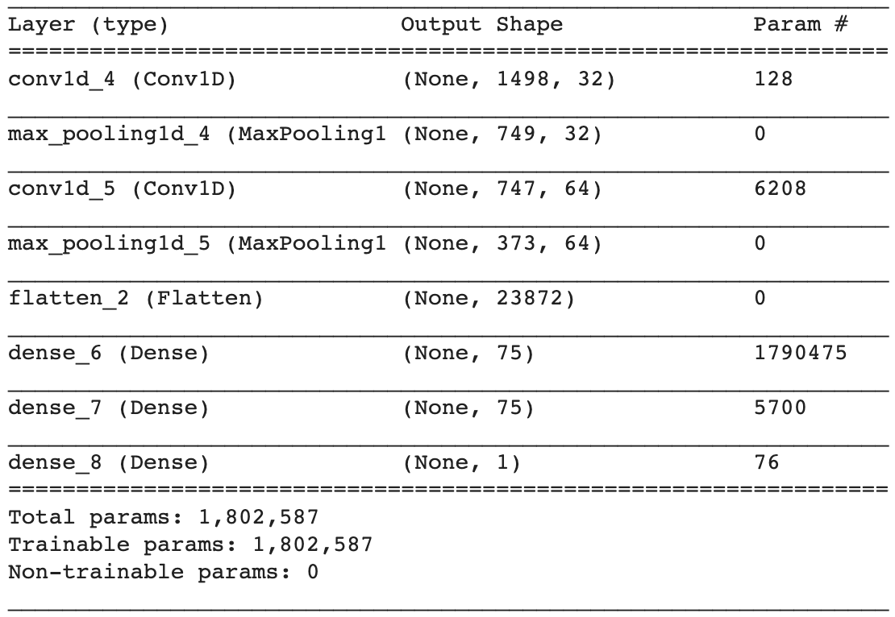
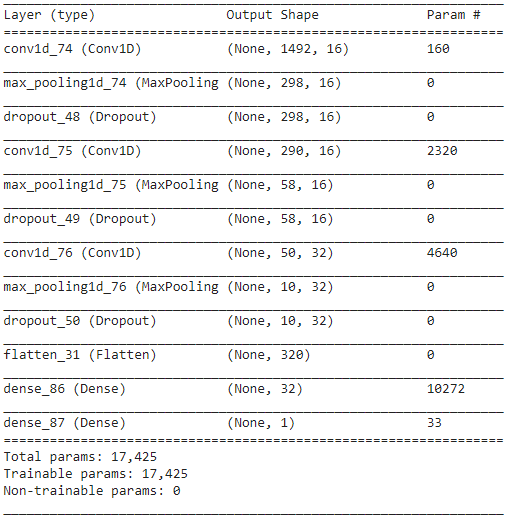

## Convolutional Neural Networks to Predict whether existance of COVID-19 based on EKG

### Abstract

Given the rapid rise of the COVID-19 pandemic, lots of work has gone into devising sensitive and specific tests to detect the presense of COVID-19. There remains several open questions in creating rapid tests to determine disease severity, which would be a useful determinant of which patients to prioritize at intake in a hospital setting, and which patients are likely to need critical care. EKGs are a common, inexpensive heart signal that is easy to capture in any hospital setting. Using EKG data & corresponding viral loads from a pilot study at UW Medicine, I attempted to use LSTMs and CNNs to predict COVID-19 severity. Upon critical examination of the data and discovering low fidelity ground truth labels, I pivoted to creating a pretrained model based on control samples and used a CNN to predict whether a given patient has COVID-19 based on a 5 second sample from their EKG. This method was 75% accurate on validation data. I explore why this was the highest achievable accuracy in the Discussion section.  

### Problem Statement: 
Using a patient's EKG, can we detect whether they have COVID? 

### Background & Dataset:

Prior work suggests that a patient's EKG, ie the electrical signal from their heart, might be affected by the COVID-19 virus. In early 1999, biology researchers injected 31 rabbits with RbCV, a different coronavirus, and examined their serial EKGs by hand, measuring heart rate; P-R interval; QRS duration; QTc interval; and P-, QRS-, and T-wave voltages. The study concluded that "ECG changes observed during RbCV infection are similar to the spectrum of interval/segment abnormalities, rhythm disturbances, conduction defects, and myocardial pathology seen in human myocarditis, heart failure, and dilated cardiomyopathy. [1]" Given this information, and examining notable literature using signal processing and deep learning methods on EKGs [2, 3], an inherently time-dependent signal, leads us to consider using deep learning on the EKGs to detect COVID. 

There were 2 primary corpuses of data colleted during a collaboration between AliveCorr, a portable EKG company (https://www.alivecor.com/kardiamobile6l/), and UW Medical Center. The **Control Dataset** was 16,500 EKGs collected in 2019 from a total of 3,600 patients. Each of the patients has between 1 and 8 distinct EKGs in the dataset. The **Covid Dataset** was 1750 EKGs collected after March of 2020. 130 patients were diagnosed with COVID at the UW Medical Center, and each was sent home with a portable EKG machine. They were asked to self-administer both a COVID viral load test (a nasal swab) and the 30-second EKG using the AliveCorr device for 14 days proceeding their initial COVID positive result. 

Here is an example of the viral loads over 14 days:

  

As you might observe, not all patients have all 14 days of data, some have missing days in the middle of their progressions. 

The EKG data itself for each patient is a 9000 timestep EKG taken over a 30 second period. The signals look as follows: 

The peculiar thing about EKGs is that they're similar to a human fingerprint. No two EKGs look the same, and hence any shift that might be cause by COVID-19 on the EKGs will look different from patient to patient. This makes it hard to identify for shifts without a baseline.

### Methodology

#### Data Cleaning & Initial Results
This project began with the objective of detecting the exact viral load of a patient (recorded in the COVID-19 dataset as a result of the nasal swab. The viral loads themselves range between 15 and 45 and in our dataset, they are a semiquantitative measure that represents the number of cycles needed to detect the virus. A viral load of 0 indicates no presense of the virus, whereas a viral load of > 0 indicates that the virus is detectible within the sample. 

Here is the distribution of the viral loads:

In order to predict viral load from the EKG, I took the samples of length 9000, normalized them, split them into 5 second chunks (ie 1500 timesteps per instance) and then ran a baseline neural network. 

After training for 100 epochs, this network achieved validation mse loss of 0.3467, ie each prediction was 0.54 off from the actual target. This seemed way too high given that the data only ranged from 0 to 0.8! Also, the number of parameters of my model was in the millions compared to the number of training samples in my dataset, making it likely that I'd overfit on the training data.

Given the timeseries nature of the EKG (a signal) I realized that an LSTM might be able to capture the signal more accurately. Hence I ran a model to predict viral load using the following simple LSTM, which had far fewer parameters.

This resulted in a test mean squared error loss of 0.14555, meaning that the predictions were 0.37 off on average. Since the results were poor, for sanity's sake I ran a COVID/not COVID classifier using the COVID-19 dataset. Doing so yeilded a accuracy of 40%. Given the binary nature of the classification task, this tipped me off that something was inherently wrong with our dataset. 

#### Further examination of the data:

This happened to be around the time of the Andrej Karpathy lecture, and as per his advice I took a deep look at the dataset and realized that lots of patients would have a high viral load between days 1-4, then the viral load would drop to 0 for a few days, after which the viral load would again rise above 0 (this can be seen in the above images of patients' viral loads). 
Thus the data seems to indicate 1 of 3 outcomes:
- the patients were not adequately compliant with the guidelines on how to carry out the nasal swab, or 
- the patients were compliant, but the sensitivity of the test was too low to detect the virus on those given days (false negative)
- or finally, that the virus itself ebbs and flows in it's severity over the 14 day period.

#### Pretraining a model to predict age given an EKG:
Given the nature of the data and how I couldn't be certain about the labeling of viral loads, I decided to reevaluate my approach. Using a separate corpus of data (described above as the Control Dataset) I created a pretrained model that predicted Age from EKGs. Given that age is a high fidelity label that we had access to, this method gave the model a good way to learn about EKG data in general. This was the model I used:

MSE loss on the test set was 0.01686, which meant that the on average the model was 10 years off when guessing age. Not the best, but not the worst, given that there really isn't a huge connection between a patient's EKG and their age. 

I tried a variety of model architectures for the base model, and froze the bottom layers to retrain a head on the COVID-19 data in order to predict whether a patient had COVID or didn't have COVID.

With over 10 different model architectures, the highest accuracy I achieved when I trained the custom head was 68% on the test set. 

### Discussion of Results:

This project was unsucessful for one of a couple reasons I can identify:

- Each sample EKG was 9000 timesteps, and I broke each EKG into 6 instances of 1500 consecutive timesteps to aid in training.

<---------All 9000 steps from 1 EKG---------------> became:

<---------1st 1500 steps from the EKG ---------------> 
<---------2nd 1500 steps from the EKG --------------->.....
<---------6th 1500 steps from the EKG --------------->

1500 timesteps contains 5 seconds worth of data, ie signal for around 12 beats. Any given patient's similar 12 beat signal is repeated (from later portions of the time series) at least 5 times as seen above. Each patient is repeated in the dataset between 1 and 8 times from different days that the patient contributed EKGs to the control study. Each patient is repeated in the dataset between 1 and 14 times from different days that the patient contributed EKGs to the covid study. Thereby, very similar 12 beat samples can occur up to 84 time as seperate data instances. (Remember above when I said that an EKG is kinda like a fingerprint?) This is just a flaw with the dataset, causing lots of similar looking samples to appear in the data.

- One way to circumvent this problem would be to restrict each patient to contribute only one instance to the dataset, but this would reduce our sample to 300 control EKGs and 138 covid EKGs. Even with around 60,000 training EKGs, overfitting on the training sample occurs extremely quick, within 10 epochs. In order to reduce the amount of overfitting in our model, I used methods we learned in class, for example:
  - I reduced the complexity of our model by increasing the kernal size. In 2D spaces, with too high a kernal size, it's too hard to learn. In 1D, I turned the kernal from 3 to 9, allowing me to view and learn from larger windows. 
  - I removed Dense layers as much as possible to reduce the number of parameters. 
  - I increased the pooling factor to increase learnability and reduce the chance of overfitting. 
  - I used 3 conv layers so that we can lower the complexity further. 
  - I used dropout to help with overfitting as well. 
  - I tried Tanh and sigmoid for the last layers, modifying the targets, and using bce and mse losses. 

- I also took some precautions to make sure that I wasn't reporting an inflated accuracy:
  - I made sure to keep all samples from a given patient either in the test set or in the training set.
  - I ensured that the distribution of the samples in the test set for the custom head contained 70% control EKGs and 30% COVID EKGs. 

- Overall, given the initial accuracy of 45% predicting COVID/not COVID using the LSTM, there might not be a reason to believe that the COVID-19 virus acts on humans as the RbCV virus affect rabbit EKGs in 1999.
- This study asked patients to self administer EKGs, and thereby there could be lots of variance in their EKGs caused by them getting used to the devices or not self administering correctly. 
- Further examination of the data and some expert knowledge might help weed out data samples that are likely caused by the machine moving or the patient self administering the EKG incorrectly. 

### Results & Plots:

Using the model below, I achieved 75% validation accuracy and 64% test accuracy predicting Covid/Not Covid.

I can't share the data unfortunately, so linking to the notebook that I ran my code with isn't that helpful. 

### Video:

Here's a video of me talking about the project :) 

[Link](url)

### References:

1. Alexander LK;Keene BW;Yount BL;Geratz JD;Small JD;Baric RS; “ECG Changes after Rabbit Coronavirus Infection.” Journal of Electrocardiology, U.S. National Library of Medicine, 1999, pubmed.ncbi.nlm.nih.gov/10037086/.  
2. Adedinsewo, Demilade, et al. “Artificial Intelligence-Enabled ECG Algorithm to Identify Patients With Left Ventricular Systolic Dysfunction Presenting to the Emergency Department With Dyspnea.” Circulation: Arrhythmia and Electrophysiology, 4 Aug. 2020, www.ahajournals.org/doi/10.1161/CIRCEP.120.008437. 
3. Attia, Zachi I., et al. “Screening for Cardiac Contractile Dysfunction Using an Artificial Intelligence–Enabled Electrocardiogram.” Mayo Clinic, Nature , 1 Jan. 2019, mayoclinic.pure.elsevier.com/en/publications/screening-for-cardiac-contractile-dysfunction-using-an-artificial. 
